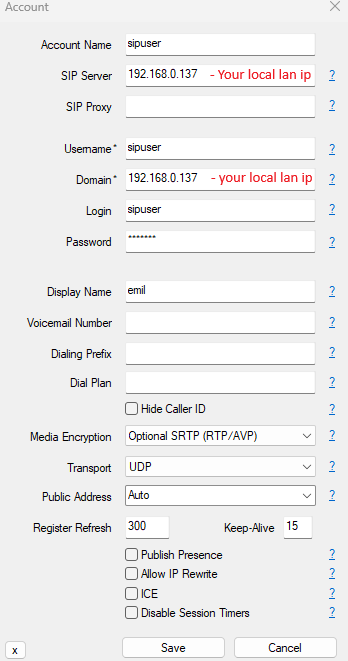

# Dev Docker setup

## 1. Clone project
   git clone git@github.com:Mbaza-Product/monorepo.git
   git lfs pull

Note: If you don't have git-lfs then you have to install it:

Install Git LFS: If you haven’t installed Git LFS yet, you can do so by running:

On macOS: brew install git-lfs
On Ubuntu/Debian: sudo apt install git-lfs
On Windows: Download from Git LFS website.

## 2. Create manully external volumes and networks:
    docker network create infrastructure_default
    docker volume create certs
    docker volume create esdata01
    docker volume create kibanadata
    docker volume create kibanaconfig

## 3. Setup environment variables for each project
    cp <root>/.env.example <root>/.env
    cp <root>/infrastructure/rabbitmq/.env.example <root>/infrastructure/rabbitmq/.env
    cp <root>/apps/zammad/.env.example <root>/apps/zammad/.env
    cp <root>/apps/ussd-custom/.env.example <root>/apps/ussd-custom/.env
    cp <root>/apps/ussd-custom/middleware/.env.example <root>/apps/ussd-custom/middleware/.env
    cp <root>/apps/ussd/.env.example <root>/apps/ussd/.env
    cp <root>/apps/ussd/middleware/.env.example <root>/apps/ussd/middleware/.env
    cp <root>/apps/tts/.env.example <root>/apps/tts/.env
    cp <root>/apps/kba/.env.example <root>/apps/kba/.env
    cp <root>/apps/deepspeech/.env.example <root>/apps/deepspeech/.env
    cp <root>/frontend/knowledge-base/.env.example <root>/frontend/knowledge-base/.env.local

## 4. Setup Virtual Hosts on your local machine:
[How to configure virtual hosts](docs/setup-virtualhosts.md)

    127.0.0.1 kba.mbaza.local
    127.0.0.1 ussd.mbaza.local
    127.0.0.1 zammad.mbaza.local
    127.0.0.1 zammad-ws.mbaza.local
    127.0.0.1 zammad_sync_cron.mbaza.local
    127.0.0.1 knowledge-ui.mbaza.local
    127.0.0.1 widget.mbaza.local
    127.0.0.1 rasa.mbaza.local
    127.0.0.1 rasa-actions.mbaza.local
    127.0.0.1 zammad-form.mbaza.local
    127.0.0.1 rasa-widget.mbaza.local
    127.0.0.1 ussd-custom.mbaza.local
    127.0.0.1 deepspeech-tts.mbaza.local
    127.0.0.1 deepspeech-stt.mbaza.local
    127.0.0.1 bakame-widget.mbaza.local

## 5. Run docker-compose up with profiles for specific services

### Profiles based on relevant application and functionality.
**docker-compose --profile ussd up**  - Starts all necessary services for running ussd application

**docker-compose --profile ivr up** - Starts all necessary service for runnind IVR application

**docker-compose --profile chat up**- Starts all necessary service for running conversational chat application

**docker-compose --profile voicechat up** - Starts all necessary service for runnind conversational voice chat application

### Profiles alternative servicies
**docker-compose --profile ussd-custom** - Starts custom ussd backend service and frontend application

### Profiles for infrastructure optional services

**docker-compose --profile logs up** - Starts Logstash and Kibana services for ElasticSearch

### Profiles for other optional frontend services
**docker-compose --profile bakame-widget up** - Starts Bakame Widget Frontend Application

**docker-compose --profile rasa-widget up** - Starts Rasa Widget Frontend Application

**docker-compose --profile zammad-form up** - Starts Zammad Form Frontend Application

## 6. Running multiple profiles at once
Ex: docker-compose --profile chat --profile voicechat up

## 7. How to use

### Access zammad and setup you data
You can access zammad interface at [http://zammad.mbaza.local(http://zammad.mbaza.local)

You will be prompted to create the admin user.

### Accessing the chat
You can access the chatbot frontend by visiting [http://widget.mbaza.local/](http://widget.mbaza.local/).  
This is the default frontend widget that supports both chat and voice chat.

To customize your chatbot configuration, edit the file at:  
`frontend/mbaza-widget/index.html`

If you want to test the other two frontend widgets, you can run one of the following commands:

**docker-compose --profile bakame-widget up** - Application will be accesible at [http://bakame-widget.mbaza.local/](http://bakame-widget.mbaza.local/)

**docker-compose --profile rasa-widget up**- Application will be accesible at [http://rasa-widget.mbaza.local/](http://rasa-widget.mbaza.local/)

### USSD and IVR Setup

1. To test USSD and IVR functionality, you’ll need a softphone application. I recommend [MicroSIP](https://www.microsip.org/), which you can download from their official website.
2. After installing MicroSIP, configure your account settings to connect to your application. Use the following example as a reference:

### Url - Service mapping
To access other services via URL, refer to <root>/docker-compose.override.yml. In this file, you'll find entries like Host('<subdomain>.mbaza.local'), which indicate the corresponding service each subdomain is mapped to.

## 8. Resources Usage on Local

### USSD
Container CPU usage
2.30% / 1600%
16 CPUs available

Container memory usage
10.19GB / 15.15GB

### IVR
Container CPU usage
7.03% / 1600%
16 CPUs available

Container memory usage
13.13GB / 15.15GB

### Chat
Container CPU usage
5.25% / 1600%
16 CPUs available

Container memory usage
12.06GB / 15.15GB

### VoiceChat
Container CPU usage
5.58% / 1600%
16 CPUs available

Container memory usage
13.12GB / 15.15GB
